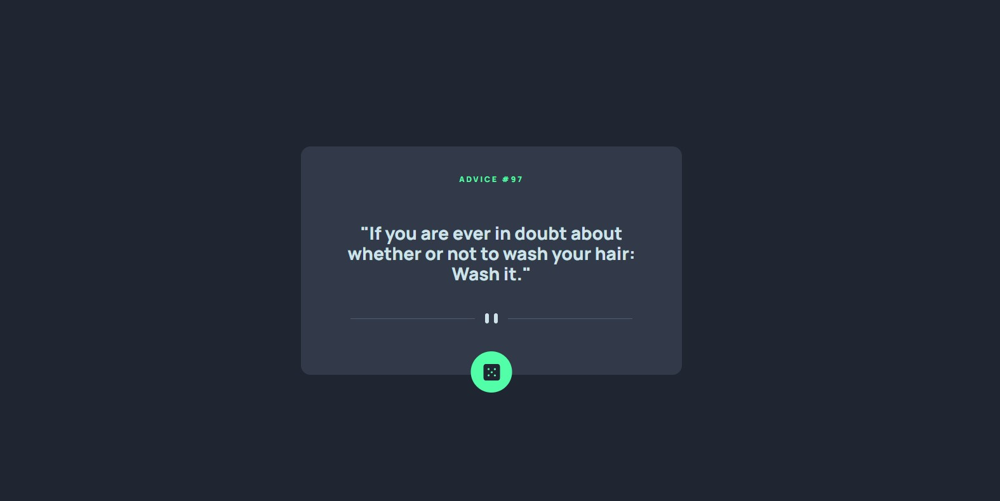

# Frontend Mentor - Advice generator app solution

This is a solution to the [Advice generator app challenge on Frontend Mentor](https://www.frontendmentor.io/challenges/advice-generator-app-QdUG-13db). Frontend Mentor challenges help you improve your coding skills by building realistic projects.

## Table of contents

- [Overview](#overview)
  - [The challenge](#the-challenge)
  - [Screenshot](#screenshot)
  - [Links](#links)
- [My process](#my-process)
  - [Built with](#built-with)
  - [Continued development](#continued-development)
  - [Useful resources](#useful-resources)
- [Author](#author)
- [Acknowledgments](#acknowledgments)

**Note: Delete this note and update the table of contents based on what sections you keep.**

## Overview

### The challenge

Users should be able to:

- View the optimal layout for the app depending on their device's screen size
- See hover states for all interactive elements on the page
- Generate a new piece of advice by clicking the dice icon

### Screenshot

### Links

- Solution URL: [Solution on Frontend Mentor](https://www.frontendmentor.io/solutions/adaptive-component-created-with-react-lib-fK5CvBeePY)
- Live Site URL: [Deployed via Vercel](https://advice-generator-app-zeta-seven.vercel.app/)

## My process

### Built with

- ReactJS
- SCSS
- Flexbox
- Chakra UI
- Create React App
- Advice Slip JSON API
- Mobile-first workflow

### Useful resources

- [HTML5 Book](https://html5book.ru)
- [MDN Web Docs](https://developer.mozilla.org)
- [Chakra UI](https://chakra-ui.com/)
- [Advice Slip JSON API](https://api.adviceslip.com/) - advice-generating resource

## Author

- Website - [GitHub](https://github.com/ostmartin)
- Frontend Mentor - [@ostmartin](https://www.frontendmentor.io/profile/ostmartin)
- LinkedIn - [Arsenii Yermoshkin](https://www.linkedin.com/in/arsenii-yermoshkin-1ba671251/)
